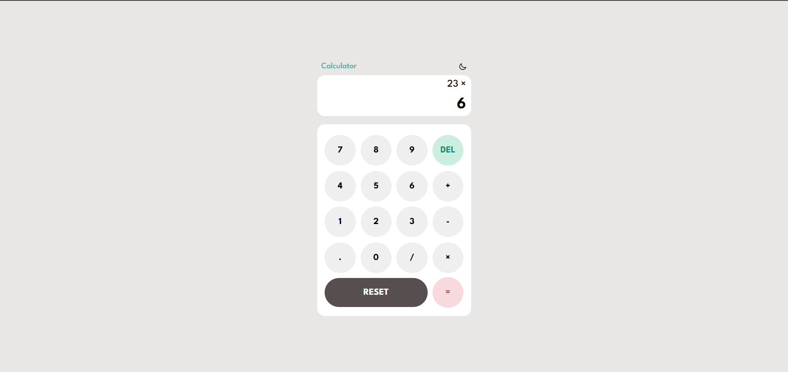
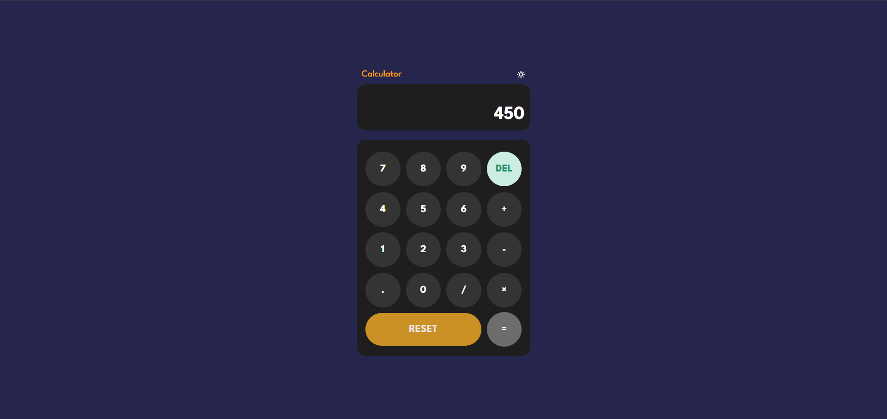

# 🧮 Calxify
A fully responsive website where you can use a calculator with light and dark theme. It works to add, subtract, multiply and divide numbers. If you need to clear all or delete some numbers, then there is a button for that too.

## The Background behind this project💡
A project that has a lot of flex box properties in it and focus on creating lot's of diffrent transitions and hover states.

## What i learned 🧠
- The `flexbox` properties
- How to select HTML element in the `DOM`
- Heavily focused on the JavaScript Loops
- Working with functions

<h3> 📸 - Demo Images </h3>

#

